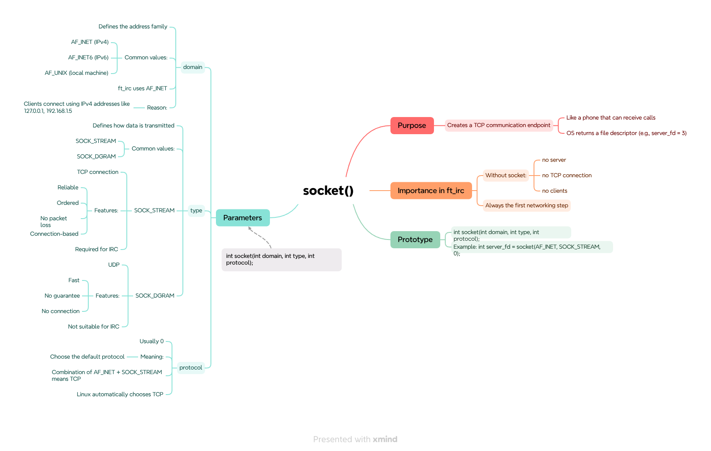
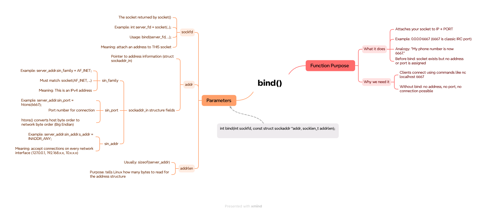
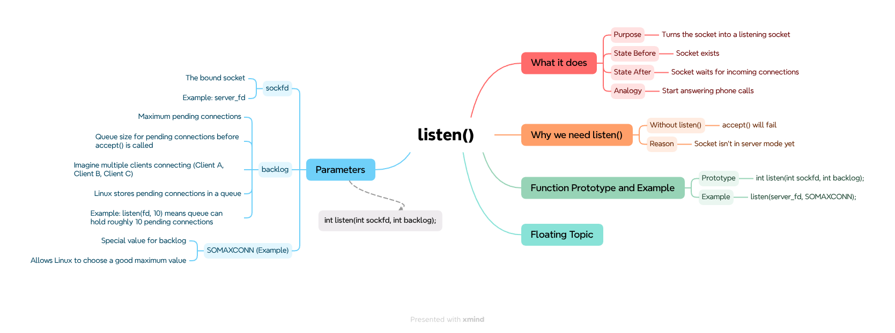
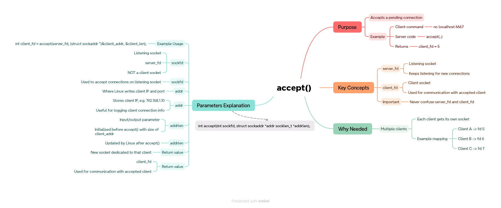
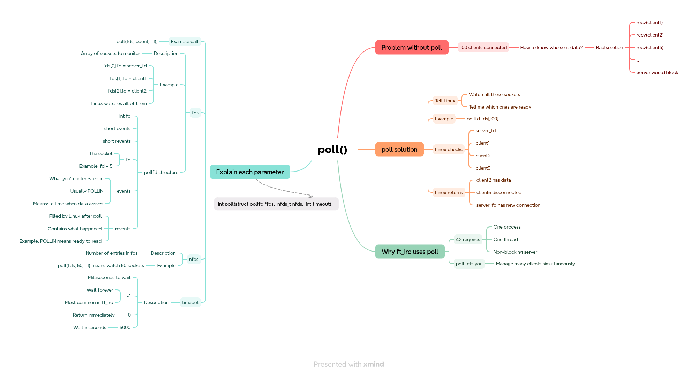
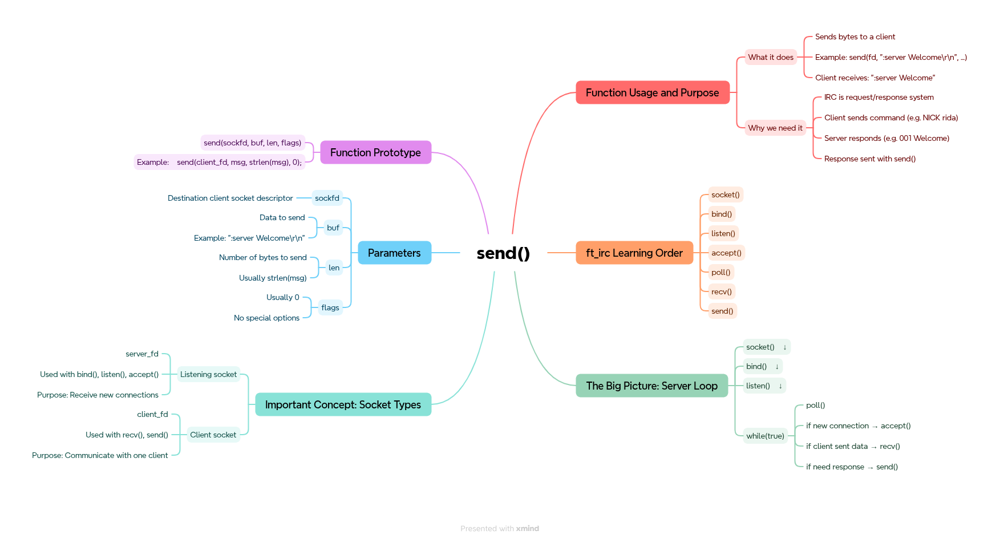
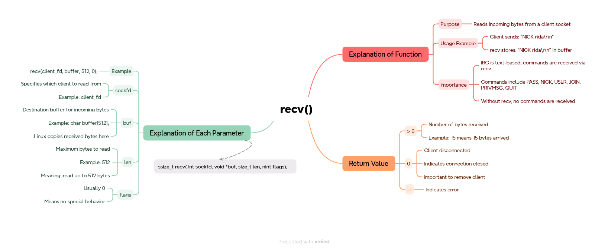

**What is IRC (Internet Relay Chat)?**

IRC stands for Internet Relay Chat and is an Internet application that was developed in 1988 by Jakko Oikarinen in Finland as a convenient way to communicate quickly with other users. 

IRC is comprised of different channels dedicated to different topics where you can exchange messages with other users from around the globe. The Internet was in its infancy when IRC was created. So, the concept of having a method like Internet Relay Chat to communicate with other users was new and exciting territory.

<b>1. socket()</b>
 

---

<b>2. bind()</b>
 

---

<b>3. listen()</b>
 

---

<b>4. accept()</b>
 

---

<b>5. poll()</b>
 

---

<b>6.send()</b>
 

---

<b>7. recv()</b>
 

---
